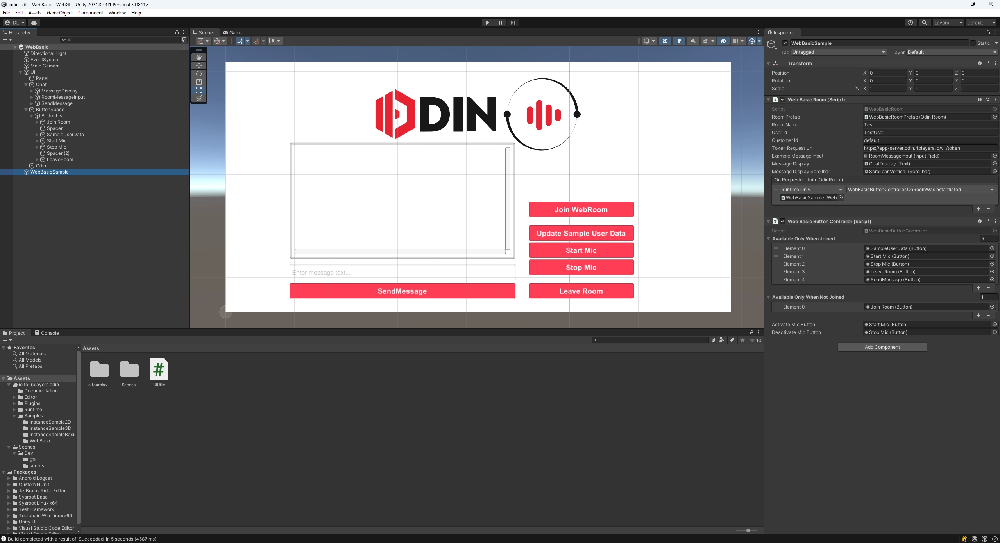

# 4Players ODIN Voice Unity SDK

ODIN Voice is a cross-platform software development kit (SDK) that enables developers to integrate real-time chat technology into multiplayer games, apps and websites.

The ODIN Voice package for Unity adds real-time VoIP communication to your game, thus making it more social and interactive, while increasing the immersion of the experience for your players.

[Online Documentation](https://www.4players.io/developers/)

## Prerequisites

Unity 2021.3 LTS or any later LTS version.

## Installation

The package can be installed in multiple ways.

### Unity Package

Please download the latest version of the ODIN Voice Unity SDK as a `.unitypackage` from the [Github releases](https://github.com/4Players/odin-sdk-unity/releases) page. Just double-click the `.unitypackage` to import it into your current Unity editor project.

### Package Manager

Using the Package Manager will ensure that all dependencies are set up correctly and that you will have the most up to date version of the SDK. In most cases, using the Package Manager is the way to go.

To open the Package Manager, navigate to `Window` and then click `Package Manager` in your Unity Editor menu bar.

#### Using a Git Repository

Click the + button in the upper left and select `Add package from git URL`. Next, enter this URL and hit enter to import the package:

[https://github.com/4Players/odin-sdk-unity.git](https://github.com/4Players/odin-sdk-unity.git)

#### Using a Tarball Archive

Click the + button in the upper left and select `Add package from tarball`. Next, select the odin.tgz archive you've downloaded from the [Github releases](https://github.com/4Players/odin-sdk-unity/releases) page to import the package.

## Samples

We ship a sample package with the Unity SDK, which contains several examples and a demo scene. To import it into your project, open the Package Manager and hit import on on the `*`Examples` package.

## Understanding the WebGL Sample

The WebGL sample scene demonstrates how to use the Unity Odin SDK when building for WebGL. Please ensure that the WebGL platform is active. This sample will not work in the Unity Editor, so to test the sample, you must build and run it in a browser.

### Scene Overview

On the left side, you can see a chat window displaying Odin room events and messages sent by other peers in the room. Using Odin's `BroadcastMessage` functionality, arbitrary data, such as chat messages, can be sent to other clients.

On the right side, there are a variety of buttons for controlling the Odin room functionality:

- **Join Room**: Starts the process of joining a room. You can view the Odin events in the chat window on the left as they are received.

- **Update Sample User Data**: Updates the current peer's user data in the Odin room. User data can be used to store arbitrary information for various purposes within your game. For more details on user data, please refer to our [in-depth guide](https://www.4players.io/odin/guides/unity/user-data/).

- **Start Mic**: Activates the microphone and connects a media stream to the Odin room. Once activated, other peers in the room will be able to hear you. 

- **Stop Mic**: Deactivates the microphone and removes the media stream. You will still receive Odin events and can listen to other peers in the room.

- **Leave Room**: Completely leaves the room and disconnects from the current session.

The `WebBasicSample` GameObject contains the `WebBasicRoom` script, which manages all the Odin-related logic, and the `WebBasicButtonController` script, which handles UI interactions and enables/disables buttons as needed.

### WebBasicRoom Sample Script

The `WebBasicRoom` script uses the following Odin classes to implement its functionality:

**`OdinRoom`**:
- **`Join(string token)`**: 
  - Called in the `JoinRoom()` method to connect to an Odin room using a provided token. You can obtain this token using `OdinWebRoom`'s `GetToken` function.
- **`GetBaseRoom<T>()`**:
  - This method is used to access the underlying `IRoom` implementation. In this script, it is used to access `OdinWebRoom`. For example, in the `SendMessageAll()` method, it sends messages in JSON format.

**`OdinWebRoom`**:
- **`GetToken(string roomName, string userId, string customerId, string tokenRequestUrl)`**: **(WebGL-specific)**
  - An asynchronous call in the `JoinRoom()` method to retrieve a token required for room connection.
- **`SendMessage(string message)`**:
  - Used in the `SendMessageAll()` method to send a message to all peers in the room. This sample demonstrates how to send a string message, but you can send any type of data as a byte array. Additionally, you can target specific peers if you don't want to broadcast your message.
- **`UpdateUserData(UserData userData)`**:
  - Used in the `UpdateUserdata()` method to update the current peer's user data and send it to other peers in the room.
- **`LinkInputMedia(CaptureParamsData captureParams)`**: **(WebGL-specific)**
  - Called in `LinkCaptureMedia()` to start the microphone input in the browser and link it to the room.
- **`UnlinkInputMedia()`**: **(WebGL-specific)**
  - Used in `UnlinkCaptureMedia()` to remove the current media stream and stop the audio input in the browser.

**`IRoom` (Base Room Interface)**:
- **`Leave()`**:
  - Called in the `LeaveRoom()` method to leave the current room.

This sample provides a basic implementation using the Odin API to showcase connecting to rooms, sending messages, managing user data, and handling audio streams. It serves as a starting point for integrating Odin's WebGL features into your Unity projects.

## Usage

The base Prefab Asset is available at `Packages/io.fourplayers.odin/Runtime/OdinManager.prefab` and Script accessibility with the `OdinHandler` class.

## Troubleshooting

Contact us through the listed methods below to receive answers to your questions and learn more about ODIN.

### Discord

Join our official Discord server to chat with us directly and become a part of the 4Players ODIN community.

### Twitter

Have a quick question? Tweet us at [@4PlayersBiz](https://twitter.com/4PlayersBiz) and we’ll help you resolve any issues.

### Email

Don’t use Discord or Twitter? Send us an [email](mailto:odin@4players.io) and we’ll get back to you as soon as possible.
